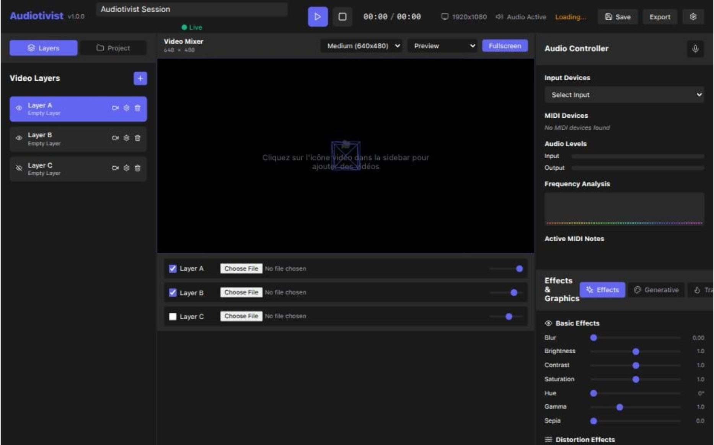

# 🎵 Audiotivist

**Audiotivist** is a modern software for parallel audio-visual production and performance. Designed for VJs, musicians, and content creators, it offers an efficient workflow for mixing video and generative graphics in real-time.

> ⚠️ **First Version Notice**: This is the initial release with known bugs and limitations. While not perfect, it provides a solid foundation for audio-visual performance tools. We're actively working on improvements!



## ✨ Features

### 🎥 **Advanced Video Mixing**
- **Multi-layer** : Up to 8 simultaneous video layers
- **Supported formats** : MP4, WebM, AVI, MOV, etc.
- **Real-time controls** : Opacity, visibility, selection
- **Multiple sizes** : 320x240, 640x480, 1280x720, 800x600

### 🎨 **Generative Graphics**
- **P5.js** : Reactive 2D animations
- **Three.js** : Interactive 3D elements
- **Audio-reactive** : Synchronization with audio
- **Visual effects** : Distortion, masks, transitions

### 🎵 **Audio Integration**
- **Tone.js** : Advanced audio processing
- **Real-time analysis** : Spectrum, frequency, amplitude
- **MIDI** : External controller support
- **OSC** : Network communication

### 🎛️ **Performance Interface**
- **Compact GUI** : Optimized for live performances
- **Quick controls** : Keyboard and mouse shortcuts
- **Fullscreen mode** : Dedicated output
- **Responsive** : Adapted to all screens

## 🚀 Installation

### Live Demo
🎬 **Try Audiotivist online**: [https://audiotivist.vercel.app/](https://audiotivist.vercel.app/)

### Prerequisites
- **Node.js** 18+ 
- **npm** or **yarn**
- **Modern browser** (Chrome, Firefox, Safari, Edge)

### Installation
```bash
# Clone the repository
git clone https://github.com/michaelgermini/audiotivist.git
cd audiotivist

# Install dependencies
npm install

# Start development mode
npm run dev

# Build for production
npm run build
```

## 🎯 Usage

### Quick Start
1. **Launch the application** : `npm run dev`
2. **Open browser** : `http://localhost:5173`
3. **Add videos** : Click the video icon in the sidebar
4. **Activate audio** : Click the audio icon to authorize microphone
5. **Mix** : Use layer controls to adjust opacity and visibility

### Main Controls
- **Play/Pause** : Spacebar or button in TopBar
- **Layer selection** : Click on a layer in VideoMixer
- **Opacity adjustment** : Slider in layer controls
- **Fullscreen** : "Fullscreen" button in VideoMixer

### Visual Effects
- **Effects tab** : Basic effects (brightness, contrast, etc.)
- **Generative tab** : Generative graphics and patterns
- **Transitions tab** : Scene transitions

## 🛠️ Technical Architecture

### Frontend
- **React 18** : User interface
- **Vite** : Build tool and dev server
- **Framer Motion** : Smooth animations
- **Lucide React** : Modern icons

### Graphics
- **Three.js** : WebGL 3D rendering
- **P5.js** : Generative 2D graphics
- **WebGL** : Hardware acceleration

### Audio
- **Tone.js** : Advanced audio framework
- **Web Audio API** : Native audio API
- **MIDI API** : Controller support
- **OSC** : Network communication

### Styling
- **CSS Variables** : Customizable theme
- **Responsive Design** : Mobile/desktop adaptive
- **Dark Theme** : Modern dark interface

## 📁 Project Structure

```
audiotivist/
├── public/                 # Static assets
├── src/
│   ├── components/         # React components
│   │   ├── VideoMixer.jsx  # Main video mixer
│   │   ├── AudioController.jsx # Audio controller
│   │   ├── EffectsPanel.jsx # Effects panel
│   │   ├── Sidebar.jsx     # Sidebar
│   │   ├── TopBar.jsx      # Top bar
│   │   ├── Timeline.jsx    # Timeline
│   │   └── ErrorBoundary.jsx # Error handling
│   ├── App.jsx            # Main component
│   ├── main.jsx           # Entry point
│   └── index.css          # Global styles
├── package.json           # Dependencies and scripts
├── vite.config.js         # Vite configuration
└── README.md              # Documentation
```

## 🎨 Customization

### Theme
Modify CSS variables in `src/index.css` :
```css
:root {
  --primary: #6366f1;
  --background: #0f0f23;
  --surface: #1a1a2e;
  --text: #ffffff;
  /* ... other variables */
}
```

### Custom Effects
Add your own effects in `src/components/EffectsPanel.jsx` :
```javascript
const customEffect = {
  name: 'My Effect',
  parameters: {
    intensity: { min: 0, max: 1, default: 0.5 },
    speed: { min: 0, max: 10, default: 1 }
  }
}
```

## 🔧 Available Scripts

```bash
npm run dev          # Development server
npm run build        # Production build
npm run preview      # Preview build
npm run lint         # Code verification
```

## 🌐 Compatibility

### Supported Browsers
- **Chrome** 90+
- **Firefox** 88+
- **Safari** 14+
- **Edge** 90+

### Required Features
- **WebGL** : For 3D graphics
- **Web Audio API** : For audio processing
- **File API** : For video uploads
- **Fullscreen API** : For fullscreen mode

## ⚠️ Known Limitations (v1.0.0)

As this is the first version, please be aware of the following limitations:

### 🐛 **Current Issues**
- **Video playback** : Some MP4 files may have performance issues
- **Audio synchronization** : Occasional delays in audio-visual sync
- **Memory usage** : Large video files can cause memory leaks
- **Browser compatibility** : Some features may not work on older browsers

### 🚧 **Work in Progress**
- **Performance optimization** : Better video rendering and memory management
- **Audio analysis** : More accurate real-time audio processing
- **UI responsiveness** : Improved interface on smaller screens
- **Error handling** : Better error recovery and user feedback

### 💡 **Future Plans**
- **Export functionality** : Save and export video projects
- **More effects** : Additional visual effects and transitions
- **MIDI mapping** : Better external controller support
- **Project templates** : Pre-configured setups for different use cases

*Despite these limitations, Audiotivist provides a solid foundation for audio-visual performance and is actively being improved!*

## 🤝 Contributing

Contributions are welcome! Here's how to contribute:

1. **Fork** the project
2. **Create** a feature branch (`git checkout -b feature/AmazingFeature`)
3. **Commit** your changes (`git commit -m 'Add AmazingFeature'`)
4. **Push** to the branch (`git push origin feature/AmazingFeature`)
5. **Open** a Pull Request

### Guidelines
- **Code style** : Follow ESLint conventions
- **Tests** : Add tests for new features
- **Documentation** : Update README if necessary
- **Performance** : Optimize for real-time performance

## 📄 License

This project is licensed under the **MIT License**. See the `LICENSE` file for details.

## 🙏 Acknowledgments

- **Three.js** : For 3D graphics
- **P5.js** : For generative graphics
- **Tone.js** : For audio processing
- **React** : For user interface
- **Vite** : For build tool

## 📞 Support

- **Issues** : [GitHub Issues](https://github.com/michaelgermini/audiotivist/issues)
- **Discussions** : [GitHub Discussions](https://github.com/michaelgermini/audiotivist/discussions)
- **Email** : michael@germini.info

---

**Audiotivist** - Create, mix, perform! 🎵✨
